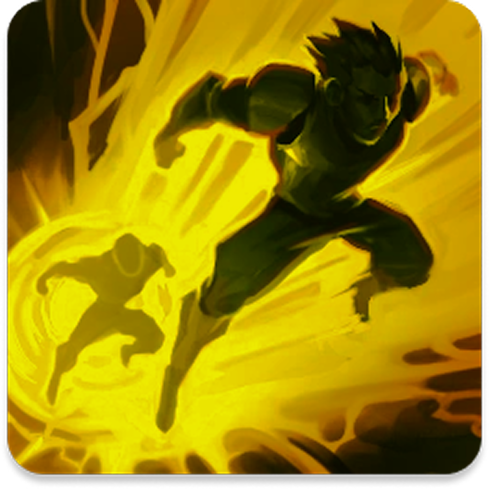

# LolTimeFlash Mobile ⚡

<p align="center">
  
</p>

<p align="center">
  <strong>Track enemy Flash cooldowns in real-time</strong>
</p>

<p align="center">
  React Native mobile app for League of Legends players to track and communicate summoner spell cooldowns during gameplay.
</p>

---

## Features

- ⚡ **Flash Cooldown Tracking** - Track all 5 enemy roles (TOP, JG, MID, ADC, SUP)
- 🎯 **Smart Calculations** - Auto-adjust for Lucidity Boots & Cosmic Insight
- 🔄 **Real-time Sync** - Multiplayer rooms with WebSocket synchronization
- 🎨 **Custom Backgrounds** - 2000+ champion splash arts to choose from
- 📱 **Native Experience** - iOS Liquid Glass support (iOS 26+)
- 🎮 **LaneGap Integration** - Lane phase assistance tool

## Tech Stack

| | Technology |
|---|------------|
| 📱 | **Expo SDK 54** + React Native 0.81 |
| 🎨 | **Uniwind** (Tailwind CSS for RN) |
| 🧭 | **Expo Router 6** (File-based routing) |
| 📦 | **Zustand** + **MMKV** (State & Storage) |
| 🔄 | **TanStack Query** (Server state) |
| ⚡ | **Socket.IO** (Real-time) |

## Quick Start

```bash
# Clone the repo
git clone https://github.com/Teczer/loltimeflash-mobile.git
cd loltimeflash-mobile

# Install dependencies
bun install

# Copy environment variables
cp .env.example .env

# Start development
bun run start
```

## Scripts

```bash
bun run start          # Start Metro bundler
bun run ios            # Run on iOS simulator
bun run android        # Run on Android emulator
bun run prebuild       # Generate native projects
bun run prebuild:clean # Clean + regenerate
bun run format         # Format code
bun run lint           # Lint code
```

## Project Structure

```
├── app/                # Expo Router screens
│   ├── (tabs)/         # Tab navigation (Solo, Multi, LaneGap)
│   ├── game/           # Game screens
│   └── settings.tsx    # Settings screen
├── assets/
│   └── champions/      # 2000+ splash arts (bundled)
├── components/         # Reusable UI components
├── features/           # Feature modules
├── hooks/              # Custom hooks
├── stores/             # Zustand stores
└── lib/                # Utilities & config
```

## Environment Variables

```env
EXPO_PUBLIC_SOCKET_URL=https://lolsocket.loltimeflash.com
EXPO_PUBLIC_API_URL=https://lolsocket.loltimeflash.com
EXPO_PUBLIC_POCKETBASE_URL=https://backlanegap.loltimeflash.com
EXPO_PUBLIC_PATCH_VERSION=15.1.1
```

## iOS Liquid Glass

The app supports iOS 26's Liquid Glass effect for a native feel. Requirements:
- iOS 26+ on device
- Compiled with Xcode 26

Falls back gracefully on older versions with a semi-transparent style.

## Documentation

See [AGENTS.md](./AGENTS.md) for detailed technical documentation.

## Related Projects

- [LolTimeFlash Web](https://github.com/Teczer/LolTimeFlash) - Web version
- [LaneGap](https://github.com/Teczer/LaneGap) - Lane phase tool

## License

This project is a fan-made tool for League of Legends players. League of Legends and all associated properties are trademarks of Riot Games, Inc.

---

<p align="center">
  Made with ❤️ by <a href="https://github.com/Teczer">@Teczer</a>
</p>
